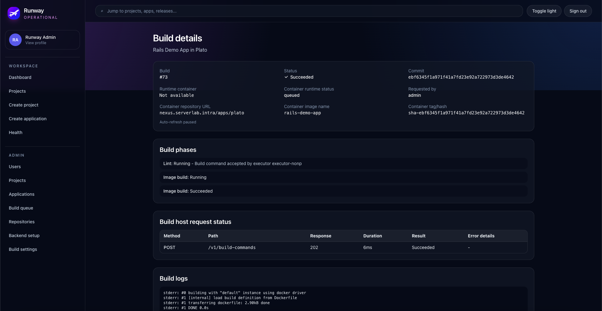
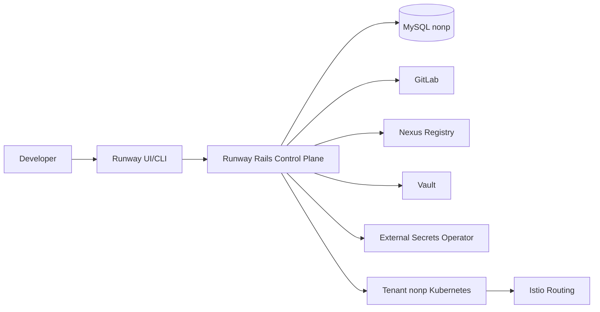

# Runway

[](https://github.com/OWNER/REPO/actions/workflows/ci.yml)


Replace `OWNER/REPO` in the CI badge link after publishing.

Runway is a Rails-based control plane for an app-centric deployment platform.

It gives teams a Heroku-like workflow for Kubernetes: users operate in terms of apps, environments, releases, deployments, config vars, domains, logs, and rollbacks, while Kubernetes resources remain implementation details.

## Why Runway

Runway is designed to make deployment feel simple without hiding operational truth.

- App-centric UX: users deploy apps, not YAML.
- Immutable releases: every deployable version is a distinct release.
- Durable deployment history: deployment events preserve timeline and context.
- Safe rollback model: rollback creates a new deployment that references a previous release.
- Secret safety: secret values are not stored in plaintext and are redacted after creation.

## Quick Start (2 Minutes)

```bash
git clone https://github.com/OWNER/REPO.git
cd Runway
bundle install
bin/rails db:prepare
bin/dev
```

Then open `http://localhost:3000`.

To validate the setup quickly:

```bash
bin/rails test
```

## MVP Scope

Included in MVP:

- Rails control plane
- MySQL in staging/production, SQLite in local development/test
- GitLab repository integration
- Nexus image registry integration
- Vault-backed config vars
- External Secrets Operator runtime sync
- Direct deployment to tenant nonp Kubernetes cluster
- Istio routing
- Release/deployment model with events and rollback
- Basic logs and app-centric error translation

Deferred beyond MVP:

- Argo CD
- Argo Workflows
- Jenkins
- SonarQube as a required deployment dependency
- Redis
- MinIO
- tenant prod deployment
- multi-cluster deployment
- autoscaling

## Core Concepts

- Project: primary ownership boundary.
- Project roles: Owner, Contributor, Reviewer.
- Project visibility: private (members only) or public (authenticated read-only by default).
- Application: deployable software unit inside a project.
- Environment: isolated target for deployments (for example nonp).
- Build: quality-gated artifact creation (lint/tests/image).
- Release: immutable deployable record (image digest, git SHA, config version).
- Deployment: an attempt to run a release in an environment.
- Deployment Event: durable event stream for deployment lifecycle.

## How It Works

### 1) Connect source control

Runway supports reusable repository connections:

- Global connections (admin-managed)
- Project-scoped connections (project-owner managed)

Runway also supports inbound webhooks for GitLab, GitHub, and Bitbucket. A merged merge-request or pull-request event can automatically request a build when the target application has webhook triggers enabled.

When creating an app, users choose a connection and either paste a repository URL or select an accessible repository. Runway validates endpoint/auth/repository access before app creation.

### 2) Define app and runtime

Users create an application inside a project and choose a runtime from the supported runtime catalog. Runtime choices are release-managed in code.

### 3) Start a build

Runway orchestrates builds through an execution adapter boundary. MVP default is an internal isolated executor running ephemeral builder containers on a Docker host.

Each build runs strict ordered quality gates:

1. lint
2. tests
3. image_build

Only successful progression produces a deployable image reference (digest).



### 4) Create immutable release

A successful build produces a release record containing immutable deployment inputs (artifact digest, git SHA, metadata).

### 5) Deploy to environment

Runway deploys the release to tenant nonp through Kubernetes API integration. Generated resources may include namespace, service account, external secret, deployment, service, and Istio virtual service.

For Rails workloads, a release command (for example `bin/rails db:migrate`) can run before web rollout.

### 6) Observe and troubleshoot

Runway surfaces app-centric status and translates platform failures into user-facing guidance.

Examples:

- `ImagePullBackOff`: image pull/registry issue
- `CrashLoopBackOff`: app starts then exits repeatedly
- `OOMKilled`: memory limit exceeded
- `CreateContainerConfigError`: likely missing config var or secret

### 7) Roll back safely

Rollback does not mutate prior releases. It creates a new deployment referencing a previous release, preserving complete history.

## High-Level Architecture



## UI Walkthrough

Use this section to showcase key flows with screenshots or short GIFs when publishing.

Suggested captures:

1. Project creation flow
2. Application creation with repository verification
3. Build history and build detail page
4. Deployment timeline and rollback action

Example markdown snippet:

```md
### Create a project


### Trigger and observe a build

```

## Build Execution Model (MVP)

Build execution is adapter-driven so runtime behavior can stay consistent if executor backends evolve.

- Current recommended default: internal Docker-host executor.
- Future options: Kubernetes pod executor, delegated adapters (for example Jenkins or Argo).

Worker protocol endpoints are exposed for internal executor callbacks under `/internal/builds/worker/*`.

## Security Model

- Team/project isolation by membership.
- Secret values are stored in Vault-backed flows, not plaintext in MySQL.
- Secret values are never displayed after creation and must be redacted in logs/UI/API.
- Deployment credentials are scoped to the required target.
- Mutation actions should emit audit events.

## Local Development

Local development and test use SQLite, so MySQL is not required on a developer machine.

### Prerequisites

- Ruby 3.3+
- Bundler

### Setup

```bash
bundle install
bin/rails db:prepare
bin/rails test
```

### Run locally

Start just Rails server:

```bash
bin/rails server
```

Or run web + Tailwind watcher via Foreman:

```bash
bin/dev
```

### Database strategy by environment

- development: SQLite
- test: SQLite
- staging: MySQL
- production: MySQL

Staging/production environment variables:

- `DB_HOST`
- `DB_USERNAME`
- `DB_PASSWORD`

Production also supports `RUNWAY_DATABASE_PASSWORD` and prefers it when set.

## Common Application Routes

- Home: `/`
- Health: `/up`
- Registration: `/registration/new`
- Sign in: `/session/new`
- Dashboard: `/dashboard`
- Projects: `/projects`

## Quality and Test Tooling

Run tests:

```bash
bin/rails test
```

Generate Sonar-compatible artifacts:

```bash
bin/rake quality:sonar_prepare
```

Artifacts:

- `coverage/coverage.json`
- `tmp/sonar/test-execution.xml`

## Repository Guide

- Product and architecture rules: `docs/PRODUCT_GUARDRAILS.md`
- MVP scope: `docs/MVP_SCOPE.md`
- Domain model: `docs/DOMAIN_MODEL.md`
- Deployment model: `docs/DEPLOYMENT_MODEL.md`
- Security model: `docs/SECURITY_MODEL.md`
- Repository connection model: `docs/REPOSITORY_CONNECTIONS.md`
- Build execution ADR: `docs/BUILD_EXECUTION_ADR.md`
- Build worker protocol: `docs/BUILD_WORKER_PROTOCOL.md`

## Current Status

Runway is under active development and currently optimized for the tenant nonp MVP flow.

Public roadmap items include production-grade multi-environment expansion, broader executor options, and deeper policy/compliance controls.

## Contributing

Contributions are welcome through issues and pull requests.

- Read contribution workflow and standards: `CONTRIBUTING.md`
- Report bugs: GitHub Issues using the bug template
- Propose features: GitHub Issues using the feature request template
- Submit changes: Pull requests using the included PR template

Before opening a pull request:

1. Run `bin/rails test`
2. Ensure changes follow app-centric product guardrails
3. Include tests for success and failure paths when behavior changes
