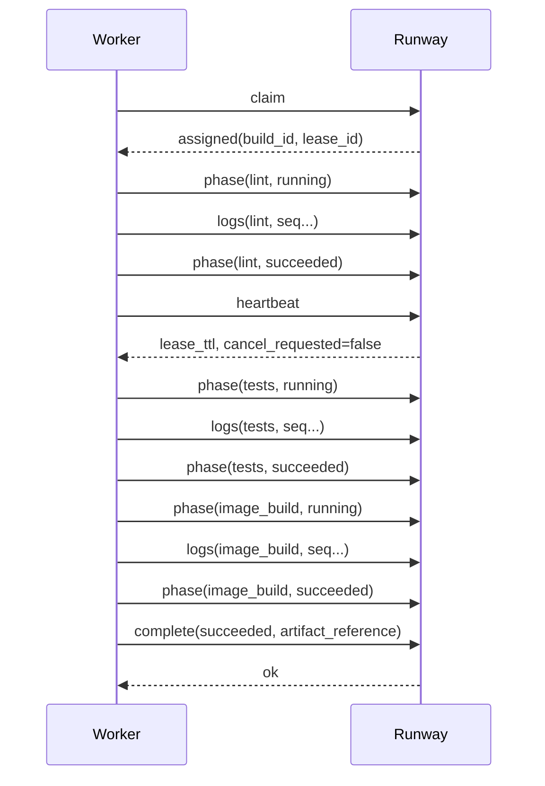

# Build Worker Protocol (MVP)

## Purpose
Define the control-plane to worker contract for Runway build execution.

This protocol is executor-agnostic. It supports:

1. Docker host workers (MVP)
2. Kubernetes pod workers (future)
3. Delegated adapters that normalize into this contract (future)

## Goals
1. Reliable job claiming with lease semantics
2. Ordered phase reporting for quality gates
3. Incremental log streaming with redaction
4. Idempotent completion and failure handling
5. Strong project and build isolation

## Non-Goals (MVP)
1. User-defined arbitrary pipeline DAGs
2. Cross-build artifact dependency graphs
3. Multi-cluster worker federation

## Build Phases
Workers must report only these phases in MVP:

1. `lint`
2. `tests`
3. `image_build`

Phase order is strict: `lint -> tests -> image_build`.

## Build Statuses
Global build statuses:

1. `pending`
2. `running`
3. `failed_lint`
4. `failed_tests`
5. `failed_image`
6. `succeeded`
7. `canceled`

Per-phase statuses:

1. `running`
2. `succeeded`
3. `failed`

## Authentication
1. Worker authenticates with a worker credential reference configured by operator policy.
2. Credentials are never persisted in plaintext in MySQL.
3. Each request includes a short-lived signed token bound to worker identity.
4. Callback endpoints validate signature, token expiry, and worker scope.

## Endpoint Contract
All endpoints are under `/internal/builds/worker` and are not user-facing.

### 1) Claim Job
`POST /internal/builds/worker/claim`

Request:

```json
{
  "worker_id": "docker-host-01",
  "executor": "docker_host",
  "capabilities": {
    "runtimes": ["ruby-4", "rails-8", "node-20"],
    "supports_image_build": true
  },
  "max_parallel": 1
}
```

Response when job assigned:

```json
{
  "assigned": true,
  "build_id": "bld_123",
  "lease_id": "lease_abc",
  "lease_ttl_seconds": 30,
  "application_id": "app_42",
  "project_id": "prj_7",
  "runtime_key": "rails-8",
  "source": {
    "repository_url": "https://gitlab.example.com/acme/orders.git",
    "ref": "main",
    "commit_sha": "abc123"
  },
  "commands": {
    "lint": "bundle exec rubocop",
    "tests": "bin/rails test",
    "image_build": "docker build -t registry.local/orders:abc123 ."
  },
  "artifact": {
    "registry": "registry.local",
    "repository": "orders",
    "tag": "abc123"
  }
}
```

Response when no job:

```json
{
  "assigned": false,
  "poll_after_seconds": 5
}
```

### 2) Heartbeat Lease
`POST /internal/builds/worker/heartbeat`

Request:

```json
{
  "build_id": "bld_123",
  "lease_id": "lease_abc",
  "worker_id": "docker-host-01"
}
```

Response:

```json
{
  "ok": true,
  "lease_ttl_seconds": 30,
  "cancel_requested": false
}
```

If `cancel_requested=true`, worker should stop at phase boundary and report `canceled`.

### 3) Report Phase Status
`POST /internal/builds/worker/phase`

Request:

```json
{
  "build_id": "bld_123",
  "lease_id": "lease_abc",
  "phase": "tests",
  "status": "failed",
  "timestamp": "2026-05-26T18:02:19Z",
  "message": "2 tests failed",
  "failure_code": "TEST_ASSERTION_FAILED"
}
```

Rules:

1. Phase transitions must be monotonic.
2. Out-of-order transitions are rejected with `409`.
3. Duplicate phase events are accepted idempotently.

### 4) Stream Logs
`POST /internal/builds/worker/logs`

Request:

```json
{
  "build_id": "bld_123",
  "lease_id": "lease_abc",
  "phase": "tests",
  "sequence": 17,
  "timestamp": "2026-05-26T18:02:20Z",
  "chunk": "Running 120 tests..."
}
```

Rules:

1. `sequence` must increase monotonically per build and phase.
2. Duplicates may be replayed and must be ignored safely.
3. Server redacts known secret patterns before persistence/display.
4. Chunk size should be bounded (for example 16KB).

### 5) Complete Build
`POST /internal/builds/worker/complete`

Success request:

```json
{
  "build_id": "bld_123",
  "lease_id": "lease_abc",
  "status": "succeeded",
  "artifact_reference": "registry.local/orders@sha256:deadbeef",
  "finished_at": "2026-05-26T18:05:00Z"
}
```

Failure request:

```json
{
  "build_id": "bld_123",
  "lease_id": "lease_abc",
  "status": "failed_tests",
  "failure_code": "TEST_ASSERTION_FAILED",
  "message": "Unit tests failed",
  "finished_at": "2026-05-26T18:05:00Z"
}
```

Rules:

1. Completion is idempotent by `(build_id, lease_id)`.
2. Success requires `artifact_reference`.
3. Failure requires `failure_code` and `message`.

## Failure Code Taxonomy (MVP)
1. `LINT_PARSE_ERROR`
2. `LINT_RULE_VIOLATION`
3. `TEST_ASSERTION_FAILED`
4. `TEST_ENV_SETUP_FAILED`
5. `IMAGE_BUILD_FAILED`
6. `IMAGE_PUSH_FAILED`
7. `SOURCE_FETCH_FAILED`
8. `WORKER_TIMEOUT`
9. `WORKER_LOST_LEASE`
10. `WORKER_INTERNAL_ERROR`

## Lease and Reclaim Behavior
1. Control plane grants lease TTL on claim.
2. Worker must heartbeat before TTL expiry.
3. On lease expiry, control plane marks build as reclaimable.
4. Reclaimed builds may be retried with a new `lease_id`.
5. Late callbacks from old lease are rejected with `409`.

## Retry Policy
1. Retry automatically for transient infrastructure failures only.
2. Do not retry deterministic lint or test failures.
3. Max retries should be operator-configurable.

## Cancellation Protocol
1. User cancels build from Runway UI.
2. Next heartbeat returns `cancel_requested=true`.
3. Worker stops safely and posts `complete` with `status=canceled`.

## Observability
1. Emit audit events for request, start, fail, success, cancel.
2. Track queue wait time, phase duration, and retry count.
3. Track worker health and lease-expiry incidents.

## Sequence


## MVP Implementation Notes
1. Start with Docker host executor workers using this exact contract.
2. Keep payload shape stable when adding Kubernetes pod executor.
3. Map future delegated Jenkins or Argo signals into this same normalized protocol.
